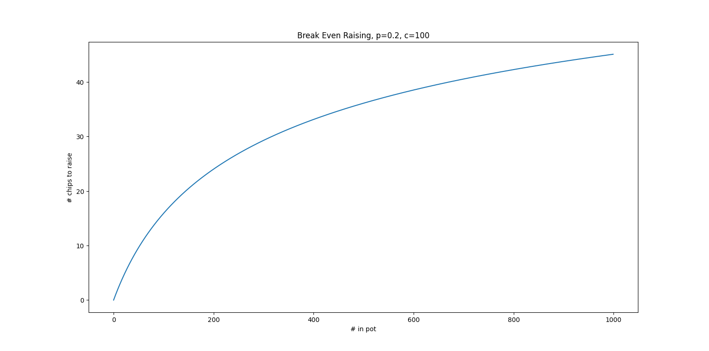

# James and Joseph's Pokerbots Code
This is the code that James and Joseph are using for the poerkbots code. It's copied
off the MIT Pokerbots' engine repo.

## How to run.
Check out `run.py`. Example usage:
```
run.py random_bot random_bot
```
-----

## Strategy

1. Use an AI qtable to approximate winning chances given the current hand/board.
2. Use the Kelly Criterion to place bets.

### Math Explanations.
Suppose you have a $p$ chance of winning. There are $n$ chips in the pot and you have $c$ chips in your hand. What is the largest number of chips you can add to the pot so that your expected log winnings do not decrease? We need
$$\log c = p\log(c + n) + (1 - p)\log(c - x)$$
$$\Longleftrightarrow$$
$$x = c - \exp\left[\frac{\log c - p\log(c+n)}{1-p}\right]$$



We bet a maximum of this amount. We want our opponents to be losing money if they call, so we may bet a smaller amount. Let $d$ be the number of chips in their hand, and $q = 1 - p$ their chance of winning. They'd win an additional $x$ chips (because that's how many we'll have just put in), so if possible we should lower our bet to satisfy
$$q\log(d+n+x) + (1-q)\log(d-x) = \log d$$
(assuming $n$ takes into account the check/continue cost).

-----

## MIT Pokerbots Engine
MIT Pokerbots engine and skeleton bots in Python, Java, and C++.

This is the reference implementation of the engine for playing vanilla Texas hold'em. **Do not update** this repo to implement the yearly game variant! Instead, create a new repo within this organization called mitpokerbots/engine-yyyy.

Improvements which help the engine generalize to new variants, run faster, handle bot subprocesses more safely, etc. should be incorporated into this repo.

## Dependencies
 - python>=3.5
 - cython (pip install cython)
 - eval7 (pip install eval7)
 - Java>=8 for java_skeleton
 - C++17 for cpp_skeleton
 - boost for cpp_skeleton (`sudo apt install libboost-all-dev`)
 - fmt for cpp_skeleton

## Linting
Use pylint.
